```{r setup, include=FALSE,message=F, warning=F}
library(knitr)
knitr::opts_chunk$set(echo=T, fig.align = "center", message=F, warning=F, fig.height = 8, cache=T, dpi = 300, dev = "png")

```


# 1. 다양한 방법들


찾아보니 스케줄러에 등록하는 방법은 다양했습니다. 아래 방법 이외에도 더 존재할 것입니다. 

1. [bat파일을 따로 저장하여(윈도우 배치파일) 이를 이용하여 스케줄러 등록](https://www.youtube.com/watch?v=V6oyhDS4FEs)

2. [Rscript.exe 파일 및 내가 실행할 R파일의 경로를 이용한 스케줄러 등록](https://www.youtube.com/watch?v=KSe1EHI-Us8&t=5s)

3. [`taskscheduleR`패키지를 이용하여 스케줄러 등록](https://cran.r-project.org/web/packages/taskscheduleR/vignettes/taskscheduleR.html)  
[`taskscheduleR` 사용방법](https://www.r-bloggers.com/2020/05/how-to-schedule-r-scripts/)


 이때까지만 해도 금방 원하는 작업을 설정할 수 있을 것 같았습니다. 위의 자료를 본 뒤에 제가 원하는 작업을 위해 따라해 봤지만 뜻대로 되지 않았습니다. 여기에는 예상치 못한 문제가 몇가지 있었습니다.  
 
 
 제가 겪은 몇가지 문제들에 대해서 소개해 드리고 어떻게 해결할 수 있는지 소개하도록 하겠습니다.

# 2. 따라하면서 발생한 문제 및 해결방안 


## 2.1 '충전기 꽂고 있을때만 스케줄러 실행' 옵션해제하기 {.tabset .tabset-fade}  

일단 윈도우 작업 스케줄러를 실행합니다. 검색창에 바로 뜨는 것을 클릭하면 됩니다.

```{r, echo=F,out.width="40%", fig.cap=""}

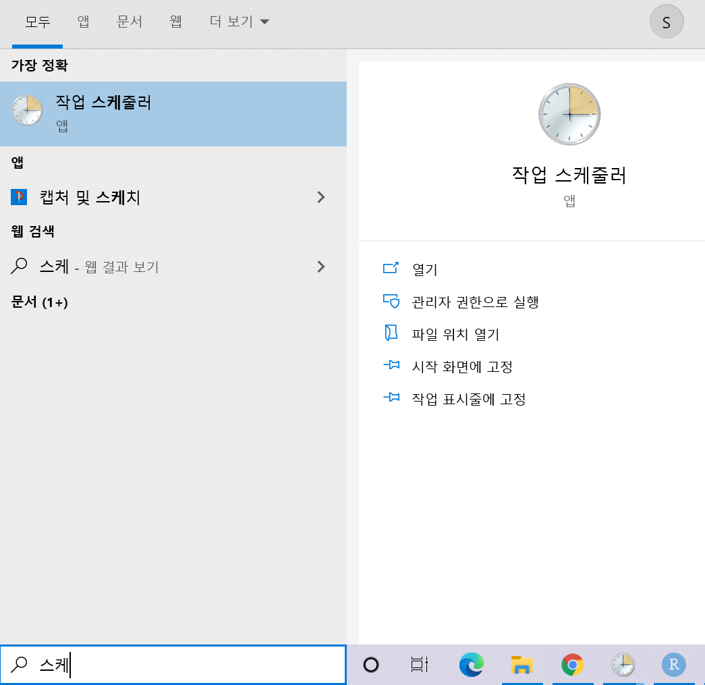

```
```{r, echo=F,out.width="40%", fig.cap=""}


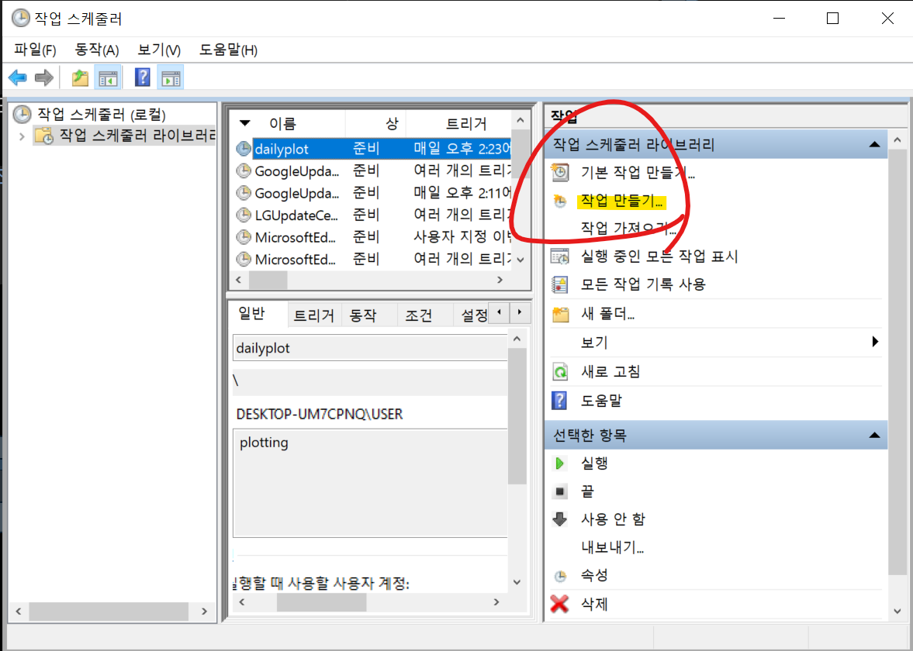  
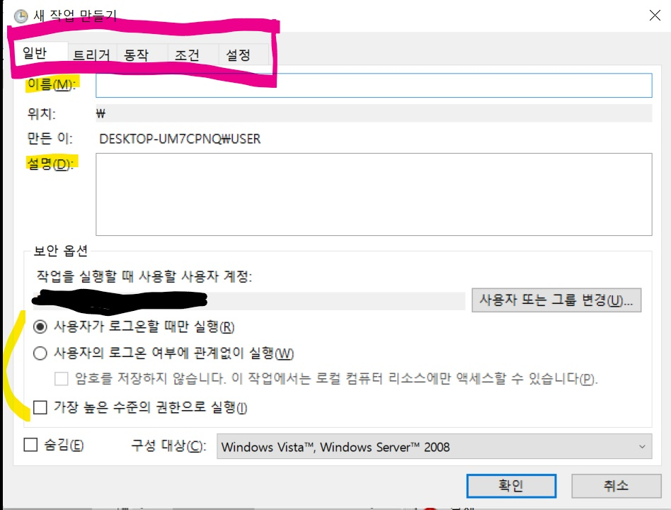
```
작업만들기를 누르면 이런 화면이 뜹니다.

---

### 2.1.1 일반 

 스케줄러의 이름을 설정하고 어떤 작업인지 내용을 써놓는 부분입니다. 
및의 보안 옵션은 어떻게 해도 스케줄이 작동했는데 어떤 차이가 있는지 자세히는 모르겠습니다.

### 2.1.2 트리거
```{r, echo=F,out.width="40%", fig.cap=""}

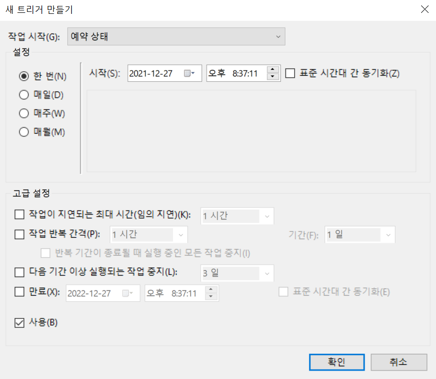
```
구체적으로 이 작업의 주기를 어떻게 정할지 설정할 수 있습니다. 저는 매주 평일마다 주가데이터를 크롤링하여 
DB에 저장하기 위해 `매주` 옵션에서 평일들을 선택하였습니다. 세부 공휴일 여부에 따른 설정은 Rscript에서 조건문으로 설정하였습니다.

### 2.1.3 동작

위에 소개했듯이 여러 방법이 있습니다만, 여기서는 `Rscript.exe`파일을 실행시키고 추가로 R파일 링크를 걸어주는 방법을 사용하겠습니다.   

```{r, echo=F,out.width="40%", fig.cap=""}

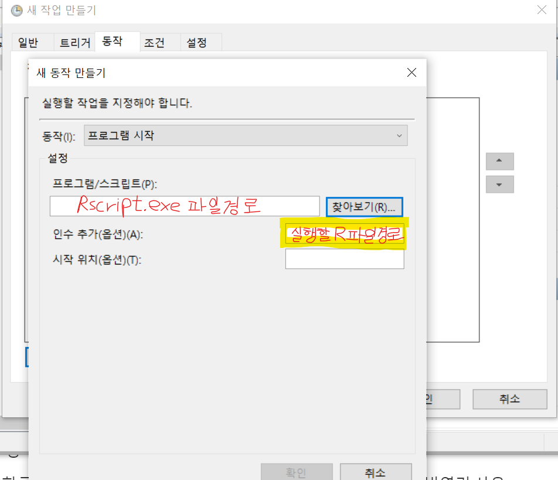

```
```{r, echo=F,out.width="70%", fig.cap=""}

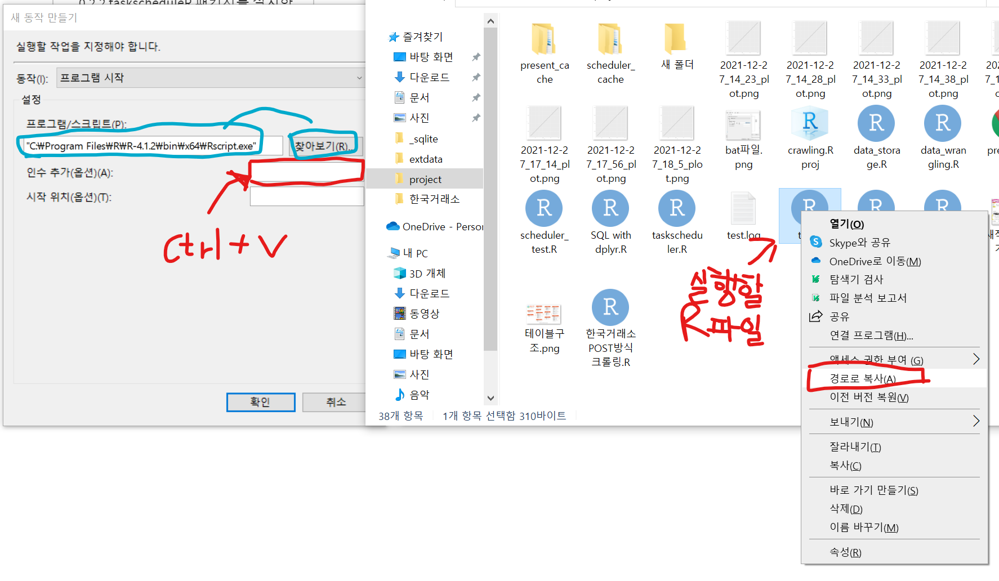


```
`Shift`키를 누르고 임의의 파일을 우클릭하면, 경로를 복사하는 선택지가 나옵니다.
여기까지는 위의 링크들을 보면 충분히 따라할 수 있었습니다.
이때 위에서 걸어둔 링크에서는 없었지만, 중요한 옵션이 있었는데요,
바로 **조건** 입니다. 

### 2.1.4 조건

```{r, echo=F,out.width="70%", fig.cap=""}

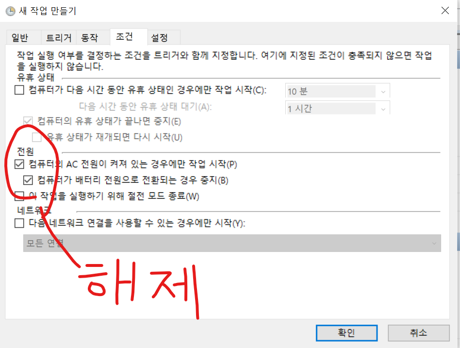


```
제가 평소에는 항상 노트북 충전기를 꽂고 작업을 하는데 하필 이거 할때 충전중이 아니었습니다. 
좀 긴 시간동안 헤매다가 이걸 발견했는데 너무 허무했습니다. 해제해두면 언제든 실행할 수 있으니 그냥 다 해제 했습니다. 옆에 있는 설정창에는 작업들이 겹치거나 오래걸리는 경우 어떻게 할지 설정하는 부분이 있습니다. 


## 2.2 taskscheduleR 패키지를 설치한 후 생기는 Addins로 작업 등록했을 경우 주의사항

```{r, echo=F,out.width="70%", fig.cap=""}

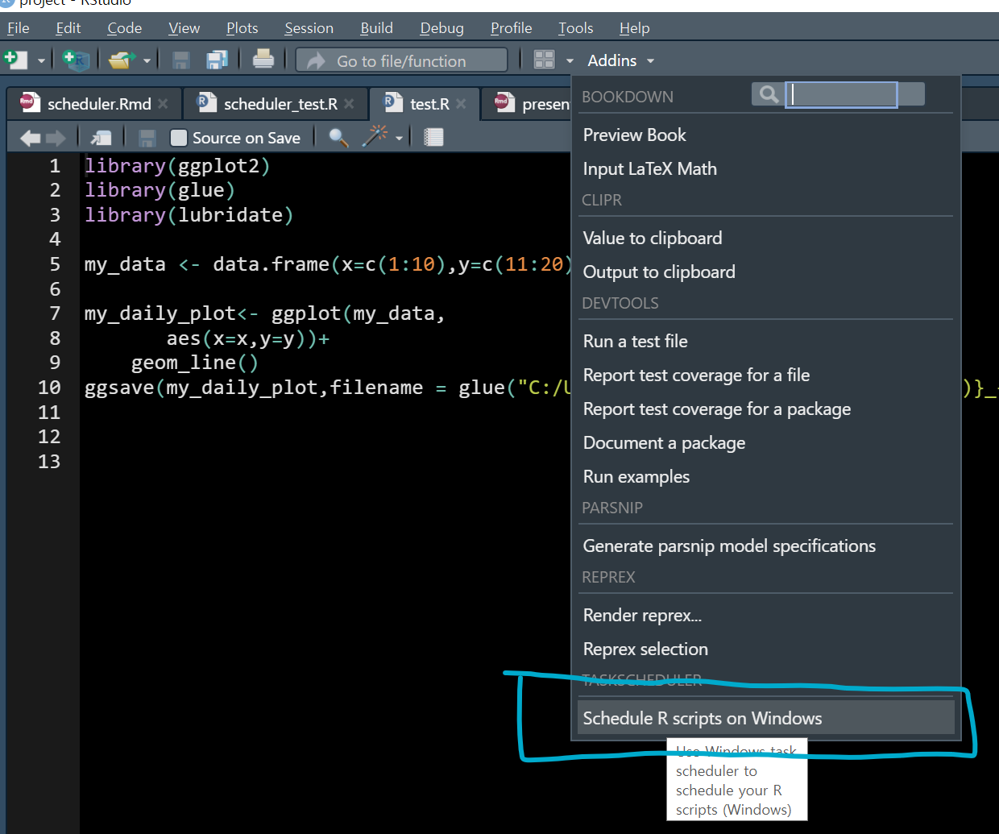


```

```{r, echo=F,out.width="70%", fig.cap=""}

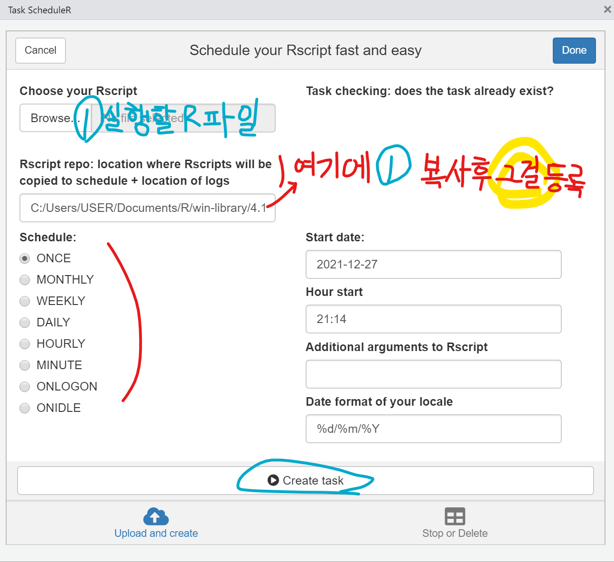


```

`taskscheduleR` 패키지를 설치하면, 명령어로도 임의의 스케줄을 생성, 실행, 삭제 시킬 수 있고, 이렇게 UI화면으로도 작업을 등록시킬 수 있습니다. 


이때 주의할 점은 **내가 등록한 Rscript를 수정했을때**, 그 수정된 결과가 자동으로 스케줄러로 실행되는 것이 아니라는 사실입니다. 왜냐하면 이 UI로 실행할 작업을 등록할때 그 Rscript파일을 임의의 위치로 복사하여, log파일과 같이 저장하기 때문입니다. 


따라서 그 위치에 복사된 **Rscript파일도 똑같이 수정한 뒤 저장**하거나, 아니면 **작업을 삭제하고 다시 등록**하면 해결됩니다.


## 2.3 한글 인코딩 문제   

이 문제는 로그파일을 보고나서야 해결방안을 찾을 수 있었습니다.  


```{r, echo=F,out.width="70%", fig.cap=""}

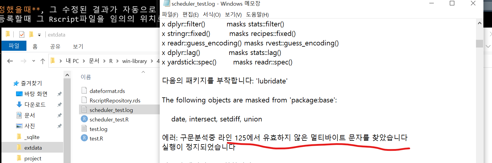


```

무엇인가 문자열 문제가 있었고, 지금까지의 경험상 인코딩의 문제일 것이라 생각했습니다. 하지만 이것을 어떻게 해결해야 할지 막막 했습니다. 다행히도 저와 같은 문제를 먼저 겪고 해결방안을 정리해 두신 자료를 찾았고 덕분에 쉽게 해결했습니다. 감사합니다.


[해결방안](http://aispiration.com/data-product/windows-task-scheduler.html)
  
[유니코드 번역사이트](https://www.branah.com/unicode-converter)  


```{r, echo=F,out.width="70%", fig.cap=""}

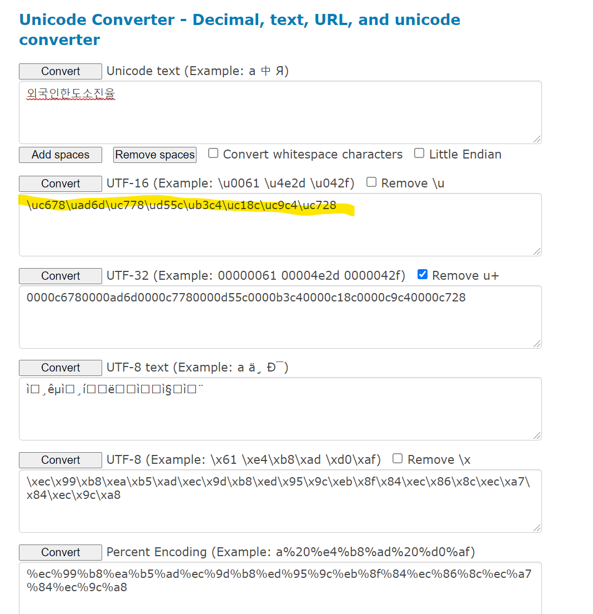

```

한국거래소에서 주가데이터를 크롤링할때 여러 데이터를 결합하여 저장하기 위해 Rscript에 한글이름으로 된 열이 있었고,

열 이름에 띄어쓰기가 있어 다시 적어주는 코드가 있었는데 이를 전부 UTF-16으로 변환하여 저장했습니다.

열 이름으로 접근하여 필터링 하는 과정들은 열 번호로 접근하는 코드로 전부 변환하니 스케줄러가 정상적으로 작동했습니다.


# 3. `taskscheduleR`패키지 응용 아이디어

* 여러 업무를 자동화 하게 된다면 하나의 taskschedule 파일을 만들어서 그걸로 전체적인 스케줄 관리가 용이할 것 같습니다.
* 하나의 스케쥴 스크립트안에 조건문으로 다른 임시 스케쥴러를 만들고 실행한 후 삭제하는 작업이 가능할 것 같습니다.


## 유의사항 ! 

컴퓨터 화면이 켜져 있을때만 작동됩니다.  
설정시간 이후에 컴퓨터를 켰을때 자동으로 그 작업을 실행시키려면 [2.1.4 조건] 에서 생략한 설정창에 가서 예약된 시작 시간을 놓친 경우 가능한 대로 빨리 작업 시작 체크!  
며칠동안 노트북 사용을 안하는 상황이 생기면 이 사실을 기억하고 조치해야 합니다.


